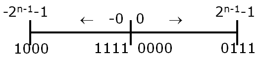
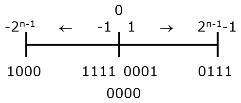
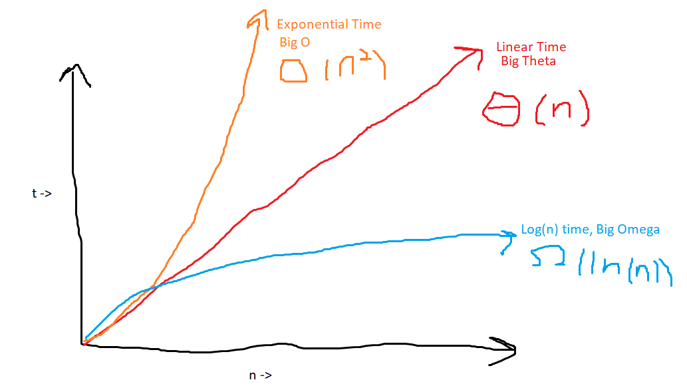
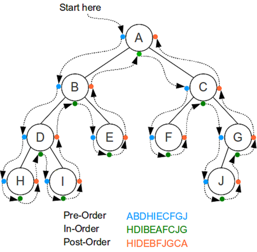
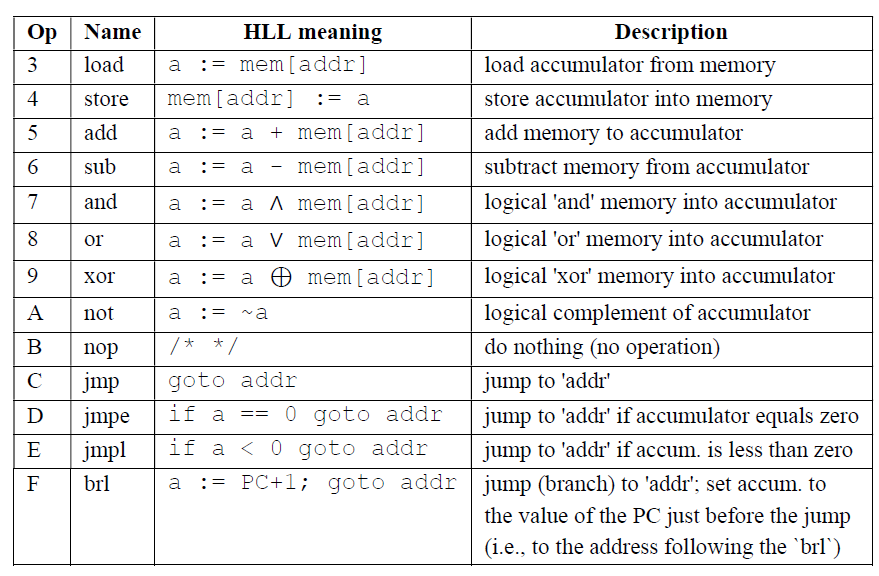

# CS 2150 Notes
## Aliases
```
alias cs='cd "/mnt/c/Users/coner/Google Drive/College Work/Semester 4/CS 2150/pdr"; git pull; cd ..'
alias cl='clang++ -Wall -g -o a.out'
alias run='./a.out'
alias memcl='valgrind --leak-check=full ./a.out'
```

## 1/15/20
Why C++?
- More efficient, more control, fast
-	Data and program rep in memory
-	Memory allocation

Hello World:
```cpp
 #include <iostream>
using namespace std;
int main() {
	cout << “Hello World” << endl;
	return 0;
}
```
Differences from java:
-	Always return 0 for compiler
-	“#” calls the precompiler to bring in resources before execution
-	In < > if with compiler
-	In “” if our own file (.h extension)
-	“Using” keyword is similar to an import, namespace is sort of like a package
-	Can not import with using OR have to call each variable or resource with “std::”
-	Use “cin >>” and “cout >>” to take information in and out, respectively

Primitive Types
-	Int
-	Can be 16, 32, or 64 bits depending on where it is compiled
-	Float
-	7 decimals accuracy
-	Double
-	15 decimals accuracy
-	Char
-	Bool

Operators and expressions
-	A condition can be either an int or bool
-	Loops are all identical- for, while, do while, break, continue

We compile with clang++ (single-pass compiler)

Functions: Methods are NOT a member of the class
```cpp
Return_type name (input_type input_name){
	Return return_type
}
```
C++ isn’t bright and will forget functions after they are used.  This can be fixed by having function prototypes with the first line of the function but no contents, telling the compiler the code for that function is coming:
```cpp
Return_type name (input_type input_name);
```
## 1/17/20
Classes in C++
- We need to split up normal class programming into files
- Main method should go in its own class (.cpp is the extension), no specific name required; files must be included

Using an object is done like:
```cpp
IntCell m2(37);
```
Note the lack of an “equals”, not using pointers or references yet, just the object.  To call a default constructor you don’t use parenthesis.

Setting an object equal to another changes the contents of the object to the same as the other.  They stay distinct but the contents copy.

“.h” file: structure for a class.  Format as follows:
```cpp
#ifndef NAME_H
#define NAME_H
class Name {
	public:
		Name( type initialValue = initVal);
		returnType name (parameters) const;
    //const means the method will not modify the contents of the object (in this context) */
	private:
		type varName;
};
#endif
```
The actual body of the method is defined in the “.cpp” file format.  Make sure to include the .h file.  You also need double colon notation to prove you are referencing the methods for the object.  Example method:
```cpp
ObjectName::methodName(parameters) { //const, if necessary
	//Method contents
	Return return;
}
```
Note in constructors, you DO NOT need to list the default values as defined in the header.  The const transfers over and is on both.  Constructors look like:
```cpp
ObjectName::ObjectName(parameters) :
	fieldName( valueName ), fieldName2( valueName2), … {
}
```
Const can also be used to set a value at compiletime that cannot be changed, declared in constructor.  C++ compilation steps:
1.	Preprocessor- spits out preprocessed files
2.	Compiler- returns object files
3.	Linker- executable files
4.	Runs on Machine code
***Use “<<” to concatenate items to print, not “+”

Objects can be destroyed just as they are created.  In your header, define a destructor with a “~” before a copy of the constructor.

## 1/22/20
Preprocessing- going through a file and dealing with the “#” things
Examples
- #include <name> or “name”: direct copy of file specified to location specified
-	Includes can recursively call each other, breaking the preprocessor
-	Always place include statements in #ifs to prevent breaking
-	```#ifndef NAME```: if not defined; runs code within it if true; also works as #ifdef
-	```#endif```: end if any if
-	```#define NAME```: Defines a macro/direct text replacement; sort of a shortcut; like defining a constant; normally in all caps
-	Also works with objects, leaves them defined but not initiated

Pointers- stores a memory address of another object, either primitive or class, ALWAYS 8 bytes in size.  To declare, use a star:
```cpp
int * x;
Rational * rPointer;
```
This is used in expression DIFFERENTLY than in declaration:
```cpp
Int * x;
*x = 2;
```
This changes the value of the object being pointed to, not the physical pointer.

Ampersands (&) are used for reference types, used to get the address of something:
```cpp
X = &y
```
(\*) and (&) work inversely

You can use a double asterisk (\*\*) to have a pointer point to a pointer

Common pointer error: Not giving the pointer something to point to/not initializing the variable

## 1/24/20
Some items work using static memory- the computer knows how much memory will be used so it can allocate and deallocate for you.  If we don’t know the amount of memory needed, we need dynamically allocated memory to have more space on the fly.  To do this, we use the ```new``` keyword.  Ex. Declaring an array:
```cpp
Int * ages = new int[n];
```
Note that since it was defined with the “new” keyword, you need to delete it with the “delete” keyword.
```cpp
Delete pointer;
Delete [] ages;
```
One pitfall is to call a pointer to access a memory address whose object you have deleted.  Doesn’t cause an error so be aware.

Note that you can define primitive types just like you do objects to shorthand.  This is more efficient than making an integer in a pointer (1 line vs 4 lines):
```cpp
Int * x = new int(0);
```
Note that if a primitive type is created with the “new” keyword, you still must delete it.

You cannot delete memory that has already been deleted, causes “double free” error.

Accessing parts of the object: Each of the following are valid:
```cpp
Rational r;
r.num = 4;
//OR, with a pointer
Rational *r = new Rational();
(*r).num = 4;
//OR, as shorthand for above
r->num = 4;
```
Sometimes other classes need to access private data members from another class.  This is done with the ```friend``` keyword:
```cpp
class ListNode {
  private:
    friend class List;
 };
 ```
 Note that ```*``` is associative.  ```char* x, y``` makes x a char pointer but makes y a char.  To avoid this, move the star to the right: ```char *x, y```
 
 ## 1/27/20
 When requesting memory, double the space needed is allocated.  A key is put in front of the memory to note how large it is, making the ```delete``` function work.
 
 *References*: Similar to pointers with a few differences:
 1. Address cannot change
 1. Address must be set when declaring (result of above)
 1. Has implicit dereferencing
 
 Example of swapping reference values:
 ```cpp
 void swap(int & x, int & y) {
    int temp = x;
    x = y;
    y = temp;
}
```
Note the use of the ampersand.

After a reference is delcared, you can use them as a normal operator, without pointer notation with arrows:
```cpp
Square & squareRef = square;
int length = squareRef.sideLength;
```
*Call by Value*: Values are copied into a new variable to be manipulated by a function.  Can be safer but is inefficient.

*Call by Reference*: References are passed as parameters.  Should be used to change actual values for an object, not copies of it.

*Call by Constant Reference*: Same as Call by Reference except with the ```const``` keyword before parameters.  Means the parameters won't be modified.

Returning types can be done like calling (value, reference, etc.)

C++ provides 4 default methods when declaring anything:
- Default constructor
	- Does nothing
- Copy constructor
	- Copies all bytes of old one into new one
	- Doesn't care about contents
- Destructor
	- Called with ```delete``` function or when code goes out of scope.
- operator=()
	- Tells cpp how to use '=' operator between two objects
	- Declaration will be in different statement than the equals
	- Just copies bytes, no knowlege of contents

## 1/29/20

You can override how any operator works between two objects.  For example, you can change how '<<' works for cout.

C++s default library is rather weak compared to Javas.  Thus, we have limited options for objects in C++.

*Vectors*: Similar to array in C++.  Has a few problems: can't be copied with '=', no notion of capacity, no index validity checking.  Some methods:

- int size(): how big it is
- int capacity(): how much space there is, not how much is in the vector
- void reserve(int newCapacity): specify size of the vector
- void push_back(Object e), pop_back(): used for stack-like operations
- Object& back(), front(): return end and beginning of vector
- Object& at(int x): get object at index
- Object& operator[](int x): overrides bracket syntax, not smart like 'at' is

*Iterators*: Nested type that represents position in a vector.  Iterators use overrides for shorthand to save time:

- ++: moves forward; --: moves backward
- \*: removes pointer to object at iterator
- ==, !=: true if same location, false otherwise
- use begin() and end() to point to the beginning or end of vector.

Use of an iterator looks as follows:
```cpp
for(vector<int>::iterator it = v.begin(); it != v.end(); it++){
	cout << *it << endl;
}
```

Vectors can do special functions with iterators: insert, erase are examples.

## 1/31/20

While Java uses inheritance to write code, C++ uses templates for functions and classes.

Function templates look as follows:
```cpp
template <typename Comparable>
const Comparable& findMax (input){
	//function
}
```
Note that no type is specified.  This tells C++ that this is a template.  We can then use this template for multiple types instead of creating unique methods for each.  It will check for operators in the function to properly override them.

You can also make these templates for classes to expand to different types of objects:
```cpp
template <typename Object>
class NewObject {
	public:
		NewObject(const Object& initValue = Object()) : storedValue(initValue) {}
		//Some Methods
	Private:
		//Some values
}
```
Note that templates can have more than one parameter, nontype parameters, and have default values for those parameters.

*Stacks*: Last In, First Out.  Like a stack of papers, add values on top, take next value from top.  Opposite is a queue.  Java provides default methods in their class such as push (insert at top), pop (delete from top), and top (get top value).  Example uses include postfix calculators, activiation records,  and symbol balancing.

Stacks can be implemented with a linked list, array, or vector.

## 2/5/20
*Radix to decimal*: Conversion of bases from another type to decimal.

*Decimal to radix*: Conversion from a base 10 number to a radix number.  Divide by radix number, take whole values left (NOT REMAINDER) and redivine, storing the remainders in order until no more redivisions are required (i.e. spits out 0r_something_).  Answer is remainders in REVERSE order.

C++ supports specifying base by leaders on a integer.  A leading '0' on a number specifies an octal (base 8) while a leading '0x' specifies a hexidecimal (base 16).  These two work well but others don't have much use.

Binary doesn't have an easy way to specify it is a binary number.  There is, however, an easy way to go between octal and hexidecimal.  Each 4 binary digits correspond to a single hex digit.  (ex. 1101<sub>2</sub> = d<sub>16</sub>)

The first computer build was the ENIAC.  Uses vacuum tubes and computed ballistic tables and an insane amout of power.  The vacuum tubes ran slow and binary representation became more popular with future technologies that allowed storing information in cells to be easier.  This allowed binary to enter the mainstream.

C defines the size of an integer or variable by implemetation definition.  It can be anywhere between small and massive.  Most machines run 32 bit integers but some run 64 bit integers depending on the machine and operating system.  ```sizeOf(int)``` tells you how large your int is.

*The Endian Debate*: Computers can change which bit is the most signifigant.  **Big-Endian** works how we think with the largest bit on the far left.  Computers, however, think in **Little-Endian** which puts the largest bit the furthest to the right.  This is primarily due to addressing; the highest address should have the highest value, which is the right most digit.  Note that this effects ONLY the BYTES, NOT the BITS.  Example: in big-endian, 0xdeadbeef; in little-endian, 0xefbeadde.  The primary issue comes with network communication.  All network communication is generally done in big-endian while computers run in little-endian.

*Integer Representation*: We generally reserve the left-most bit for the sign of the integer and use the rest to define numbers.  One must be careful; at first glance, two 0s exist.  100...0 is a -0 while 000...0 is a 0.  We deal with this a few ways:

- One's Compliment:
	- 
	- No longer used
- Two's Compliment:
	- 
	- Most commonly used
	- One more negative value as compared to positive values

When integers overflow, it will effect the sign bit at the beginning and change the sign/magnitude of the bit.  Note that, by how Two's Compliment works, this overflows from the max to the min value (which has a magnitude one greater than max!).

Note that C++ also has the ability to have unsigned ints.  Thus, we just remove the signed bit and have a lot more potential values.  This is commonly found for returning the size of an object as they cannot go negative.

## 2/7/20
*Real Numbers*: Used to use fixed point real numbers: they only used the decimal point in a single spot and stuck a decimal at the end, doesn't work for infinite fractions.  Now we use floating point fractions in scientific notation: sign bit, mantissa bits, and exponent bits.  They use the breakdowns as follows:

- bit 1: sign bit, 1 means negative (1 bit)
- bits 2-9: exponent (8 bits)
- bits 10-32: mantissa (23 bits)
	- mantissa= 1.0 + (sum){i=1},{23} b_i/2^i

And exponent values work as follows:

- 0: zeros
- 254: exponent-127
	- The value of 127 is called the exponent offset or the bias
- 255: infinities, overflow, underflow, NaN

*Converting float from binary to decimal*:

Given: 0100 0001 1100 1000 0000 0000 0000 0000

First bit -> sign = (+)

Next 8: 100 0001 1 -> exp = 131 - 127 = 4

Mantissa: 100 1000 0000 0000 0000 0000 -> mantissa = 1.5625

- The '1' bits in positions 1 and 4 represent (1/2)^1 and (1/2)^4; That's 0.5 + 0.0625 = 0.5625, add one to get the final value.

-> 1.5625 * 2^4 = 1.5625 * 16 = 25.0

*Converting float from decimal to binary*:

Take out sign bit.

Find what power of 2 is required to bring the number to 1.0 <= x < 2.0.  Multiply -> negative, divide -> positive.

Mantissa = f/2^exponent.  Make sure to subtract 1 to get your decimal range.

Max value of this form: 2 * 2^127 = 3.402823 * 10^38; Min (i.e. closest to 0) value for this form: 1 * 2^-126 = 1.175494 x 10^-38

Note that this form is not spatially uniform... changing one bit doesn't produce a 'constant' change.  Higher exponents will 'gain' more when the mantissa increases.

## 2/10/20

When you have a repeating decimal appear during its binary conversion, you can't accurately store it.  Thus you end with not exactly the same number, just long trains of decimals that aren't quite whole numbers.  This means comparisons with floating point numbers can lead to stealthy logical errors.  If you want to get around this, set a decimal criteria for how close things are and compare that (```bool test = fabs(x-y) < error;```).

You can test for these repeated decimals by looking in the decimal form.  If its denominator has factors that are not factors of the radix, it will repeat (and in our case, radix = 2).  To get around this you can use a rational class or more digits (BigFloat).

In 64 bits, the layout is as follows:
- 1: sign bit
- 2-12: exponent (11 total)
- 13-64: mantissa (52 total)
- Exponent offset: e^(e-1)-1 = 1023

*Arrays*: Primative type that holds objects in a list like format.  Can be specified either of these ways:
```cpp
int someInts[3];
int someInts[] = {1,2,3};
int* someInts = new int[3]; //requires deletion with the delete[] keyword
```
Note when making an array, it allocated one more space for a pointer to the array.  I.e. array\[3\] reserved 4 spots in memory.

Note that C++ doesn't allow you to delete the value of an array name.  This is due to the complier doing deallocation itself and it doesn't want to lose where that array is.  Imagine this as a constant pointer.

Notes to remember about arrays:
- No index checking/bounds checking (doesn't know if you're asking about an index out of range)
- When passed as an argument, it has no clue of the size.  Will have to pass as a parameter.
- Cannot be copied or compared with = or == (checks if same memory location), respectively.  Must be done manually.

## 2/12/20
The array "pointer" created points to the first value of the array.  The array then increments its address by the size of the object so the computer always knows where to look.  Multidimensional arrays are organized by the furthest right index incremented in memory first then moving all the way to the right.  This is known as *Row Major Order*.  I.e. a\[0\]\[0\] -> a\[0\]\[1\] -> ... -> a\[1\]\[0\].

Due to the way C++ works, you can have bounds overflow and be accessing a different cell than you may think.  As an example, in a 1x2 array, a\[1\]\[2\] == 1\[0\]\[5\].

*Passing parameters into main*:
```cpp
int main(int argc, char* argv[]){    //char* is known as a C-string
	return 0;
}
```
Note when you specify no command line parameters, argc = 1 b/c argv\[0\] is the name of the program.  

C-strings can be converted to a string with the ```string s()``` method.  Then they work as we intend.

*Order of Growth*:
- Big O: runs less than (<=) a certain bound; upper bound
- Big Ω: runs greater than (>=) a certain bound; lower bound
- Big Θ: runs following a certain function; tight bound
- 
- Note that these only apply to large amount of values and is negligible at smaller numbers

To analyze a function f(n) as compared to a function g(n), we assusme f(n) is above Big Θ and Below Big O.  We also assume we are finding the worst case element.  This leads us to define:
- O(g) is the set of functions f, st. f(n) <= c\*g(n) for all n > n_0
- Ω(g) is the set of functions f, st. f(n) >= c\*g(n) for all n > n_0
- Θ(g) = O(g) and Ω(g)
	- Θ(g) is the asymptotic order (or just the order) of g
	- f is element of Θ(g) is read as "f is (asymptotic) order g"

Note that the c is used to cancel any constants seperating f(n) from g(n).  This removes the time unit from the equation (things like the computer/OS used) to allow a direct comparison.

## 2/14/20
Proof for Big-O examples:
```
Prove: 10n is an element of O(n)
10n is an element of O(n)
10n <= c and for all n > n_0
	let c = 10
10n <= 10n for all n >= n_0
1 <= 1 for all n >= n_0
QED
```
Note any n_0 or c can be chosen, but they should be picked strategically to prove understanding.

Note we use "is an element of" NOT =.  This is on purpose; Big-\* are sets.

Note Big-Ω uses the same proof, just with a comparator change from less than to greater than

To prove Big-Θ, we must prove the function is Big-O AND Big-Ω of the same function.

Little-O also exists.  This uses less than instead of less than or equal to.  This strictly defines something as a lower bound which implies it **cannot** be Big-Θ.  Little-Ω also exists.

Some functional properties:
- Reversing big-O: f ∈ O(g) ⇔ g ∈ Ω(f)
- Adding big-O: O(f + g) = O(max(f, g))
    - Similar equations hold for Ω and Θ
- Transitive: If f ∈ O(g) and g ∈ O(h), then f ∈ O(h)
	- Big-O is transitive, as are all the others (big-theta, big-omega, little-oh, and little-omega)
- Reflexive: f ∈ Θ(f)
	- As are big-O and big-omega
- Symmetric: If f ∈ Θ(g), then g ∈ Θ(f)
	- Big-Oh is not symmetric! (neither are Ω, o, or ω)
- Θ defines an equivalence relation on the functions

Reminder that c^n grows faster than n^k for all c, k > 1.

Loops generally run in n time.  As you nest them, it raises per each loop (3 nested loops -> n^3).  Remember to take the worse case route.

Examples of algorithm running times:
- Constant: Size of vector, linked list insert or delete, finding nth element in array/vector
- Log (space cut in half each iteration): Binary/balanced tree search
- Linear (process for each element): printing, find in unsorted array, find in link list, doubling a vector's array
- LogLinear (doing a log operation on each element): mergesort, heapsort, quicksort (on good day), inserting at log time
- Quadratic: insertion sort, bubble sort, selection sort, quicksort (on bad day), graph algos, double nested loops

## 2/17/20
*Trees*: Each element in a set that has up to n connected children.  Unlike lists, not every element has an individual direct relationship with its following element.  Trees can have multiple children, creating more complex web connections.

Lingo:
- Parent: Node above the current node
- Child (left and right): Nodes below the current node
- Root: Node with no parent
- Leaf: Node with no children
- Siblings: Two nodes with the same parent
- Height of a node: *Longest* path from current node to a leaf
- Depth of a node: Longest path from current node to a root
- Path: sequence of nodes
- Length: number of edges (connections between nodes) in a path
- Internal Path Length: Sum of the depths of all nodes in a path
- Ordering:
- 
	- Note that infix notation can get confusing while working with expression analysis.  Parenthesis matter in order to properly enforce order of operations.

General types of trees:
- Parse tree: builds a tree out of an equation in order to properly interpret it.
- Geneology tree: has complex relationships between nodes (i.e. steps, greats, etc.)
- First Child/Next Sibling notation: Each TreeNode has a firstChild and a nextSibling field to create trees with n number of children per layer

*Binary Search Trees*: Max of 2 children per node.  Nodes to the 'left' of the current node are less than the current node; nodes to the 'right' of the current node must be greater than it.  No duplicates are allowed.  BST Methods:
- Find: look at current node (starting at root).  If less than value, recurse left.  If greater than value, recurse right.  If you reach a null,  it is not in tree.
	- Note that this is still a LINEAR algorithm assuming the tree doesn't have to be balanced.
- Insert: Do find, insert when you find a null.
	- Example Code:
	```cpp
	void BST::insert(int x, BinaryNode * & curNode) {
    		if (curNode==NULL)
      			curNode = new BinaryNode(x,NULL,NULL);
   		else if (x < curNode->element)
        		insert(x, curNode->left);
    		else if (x > curNode->element)
        		insert(x, curNode->right);
    		else
        		;    
	}
	```
- Find Max: Keep going right until NULL
- Find Min: Keep going left until NULL
- Removing (no children): remove the node outright
- Removing (one child): replace node with child
- Removing (two children): replace with next least child in the RIGHT subtree of the node to be removed (i.e. next highest number in the tree)
	- Note this also works with the next smallest value; however, in this course, we will use the next highest value

Note that the max height of a tree is 2^(h+1)-1.  (Proved by induction)

## 2/19/20
Perfect binary tree: full elements on every level => that it can only hold 2^n-1 elements (n > 0).

*Expression Tree*: A way to keep internal representation of a math equation.  Can be written in pre/in/post-fix.  You can build a tree (from postfix) as follows:
- Use a stack of node **pointers**.  This is so we can properly change the objects and their values.
- Push values to the stack
- When you reach an operator, pop the top two values of the stack as the operator's children and push the operator to the stack

*AVL Trees*: A type of balanced binary tree that keeps the tree balanced to allow Θ(logn).  We do this by manually balancing the tree when certain nodes are added to it that unbalance it.  We define balanced as *the height of the left and right subtrees differ by at most 1*.

To maintain this balance, we give AVL nodes an additional variable: a balance factor.  The balance factor is the height of the right subtree minus the height of the left subtree.  This value should be between -1>=bf>=1 and the tree should adjusted if it reaches either -2 or 2.

## 2/21/20
AVL Trees run find the same as a BST.  However, insert is slightly different.  If the inserted node causes an unbalace in the tree, the tree will have to be 'rotated'.  The balance factors that can be modified are those only in the path of the insert of the node.  Insert still runs in log(n) time.  These rotations work as follows:
- Start from inserted node.  Work way up until you hit a node that is unbalanced (-2 or 2).  This implies that the lowest nodes will fix the higher up nodes, meaning only one rotation will be necessary.
- One of the following cases will cause the rotation:
	- Left subtree of left child of x
	- Right subtree of left child of x
	- Left subtree of right child of x
	- Right subtree of right child of x
- The first and last case require a single rotation.  The middle two require a double rotation.

*Single Rotation*: Used for a left-left or a right-right imbalance.  The node below the unbalanced node becomes the new parent for the unbalanced node.  The unbalanced node the becomes a child of the lesser side of the tree and takes on that subtree as a child.  Works either right or left.
- Note that the subtrees will change with the node: if a right rotation, the node moving up's right tree *moves up* with the node and enters its new right subtree with the previous values.  Same as reversed with the left.
- Node that at least one node will move up and one will move down, simultaneously increasing and decreasing the depth.

*Double Rotation*: Used for a left-right or right-left imbalance.  Double rotations are used as two independent single rotations: one on a child and one in the other direction on a parent.  I.e. in a node inserted in a left child's right subtree, rotate around the left child to the left.  The rotate the node to the right.  The same works in reverse.

Note you can determine what type of rotation you need based on the signs of the balance factor of the unbalanced node and the child of its direction.

Other runtimes: remove is log(n), print is n.

## 2/24/20
*Tail Recursion*: Returning exact values instead of performing an operation on each call of the function.  Tail conversion is recognizeable by a compiler and can be optimized into a for loop automatically.  

*Red-Black Trees*: A type of tree where each node is either RED or BLACK.  They also rotate and move nodes around just like an AVL tree.  The properties of a R-B tree are as follows:
- All nodes are red or black
- Root is always black
- Leaf Nodes (null children) are always black
- Both children of every red node are black (no red nodes on top of each other)
- Every simple path from the node to any descendent leaf takes the same number of black nodes
	- This implies the max path length will be 8 nodes long (half black, half red)
	- This makes *layers* in the tree of black nodes specifying depth... ok to have red between them
Inserting in R-B trees has a few cases:
- Insert as normal for BST and color it red
- One of 5 cases occurs:
	- The new node is the root node
	- The new node's parent is black
	- Both the parent and uncle (aunt?) are red
	- Parent is red, uncle is black, new node is the right child of parent
	- Parent is red, uncle is black, new node is the left child of parent

Removing works similarly to an BST as well but has **6** removal cases as well.  These are:
- N is the new root
- S is red
- P, S, and S's children are black
- S and S's children are black, but P is red
- S is black, S's left child is red, S's right child is black, and N is the left child of its parent
- S is black, S's right child is red, and N is the left child of parent P

Both of these always run at log(n) time.  This means they are consistenly faster than AVL trees and this is their primary use.  These are some benefits with history and less rotations but those are sort of ignored.

*Hashing*: Used for CONSTANT TIME find().  Stores in key-value pairs, meaning it can be near constant if we 'encode' and 'decode' information into hashes.  This works by putting your key into an HASH function which converts your key into an *unsigned* integer.  You then store the value into that key's hash (its 'number') so we can always know where to find it based on your hashing algorithm.

These hash functions must meet certain conditions: must produce an *unsigned* int, must be deterministic (always returns the same thing), must be fast, and must be evenly distributed.

## 2/26/20, 2/28/20
When createing hash functions, one must be careful when working with size (compared to number of nodes), amount of memory used, speed of the hash (a log(n) hash doesn't help us at all), and other considerations.  A *collision* is when two keys hash to the same value and can be complicated to deal with.  This means we define a *perfect hash function* has no blanks and no collisions on top of all the previous requirements.

An example string hash function could work as follows:
- hash(s) = s0 mod table_size
- hash(s) = (sum of all the letters) mod table_size
	- This still won't be evenly distributed
- hash(s) = (sum of all letters; multiply each letter by 37^i) mod table_size
	- This will be more evenly distributed; works better with a prime number
	- Can help to precompute these values and avoid the .pow function
	- This will still overflow.  That is perfectly ok assuming it overflows *deterministically*

We can deal with collisions multiple ways:
- Separate chaining: we keep values in a linked list in each of the array elements.  The array is full of pointers to the start of a list and each node in the chain points to the next hashed value at that index
	- The worse-case for this hash table becomes *linear* because each hash value could go to the same spot, making it linear.  It will typically run in constant time but theta(hash) would still be linear.
	- You could try to game this system by making a red-black tree run in each index but this makes it even more inefficient: too much overhead.  These mostly operate with small values which don't make sense for a r-b tree
	- *Load Factor (lambda)*: ratio of number of elements divided by the table size.  This is the average number of elements in a bucket for separate chaining.  On an unsuccessful find, we hit lambda average time.  On a successful find, we hit 1+(lambda)/2 time.
	- We can use this load factor to define the size of the hash table.  These change based on the allowed lambda and call a rehash function when that value is reached.
		- lambda = 1: average bucket size is 1, make it be the number of elements expected
		- lambda = 0.75: table > # elements, good trade off of time and memory, used by Java, lower change of collision
	- We can make separate chaining insert constant time by inserting at the front of the list
- Open addressing: changing the address of a value if something is already there.  Multiple types exist:
	- Linear: if the spot a value is hashed to is full, add one to that value until a free space is found.
		- Still linear time!  May have to probe through full list
		- Look for value in hashed cell then keep adding 1 to the one you check until you find it.
		- This tends to form clusters of inserted values
		- This also can form holes when removing values.  Fix for this further down.
	- Quadratic: instead of incrementing by one, check i^2 cell (i.e. 1, 4, 9, ...)
		- Same format as linear but jumps out of clusers much faster
	- Double Hashing: creating a second hashing function to help find a spot
		- Increment hash_1(k) + i\*hash_2(k), let i=0 -> inf
		- Ensure secondary hash isn't 0, set it 1 manually
		- Faster than the other options but more complicated
		- This can cause thrashing: when the hash loops around the array while all values are filled.  To fix this, *our tables much have a prime number length!*
		- Note this function is given to us in the lab
		
Rehashing: when a load factor gets too close to a certain value, we may need to increase the size of the table
- Easist to base when to do this on your load factor hits somewhere around 0.5 or 0.75, it can also be done when an insert fails or some other reason.
- Must rehash every value, they will likely go into different spots
- This is horribly inefficient.  Worst case is O(n^2).

Removing an element
- No good way to do this
- Rehash upon delete is very expensive
- You could put a placeholder/sentinel value, but it is difficult to deal with them; works well for insert but not find (ends up becoming linear)
	- could rehash when percent of table becomes a placeholder (5-10%)
- By this factor this isn't a good data structure for a lot of removals

## 3/2/20
*IBCM*: custom made assembly code used to get concepts for how assembly works.  Translates DIRECTLY to bits.  Important for machine designers, compiler writers, OS programming, etc.

Processor design notes: Registeres run in *1* CPU cycle.  Memory runs in ~100 CPU cycles: very slow compared to on-processor memory.  Cache is the middle ground between the two and takes around 3-5 CPU cycles.  This optimized your CPU by copying values to cache and operating on them in there.  

Fetch Execute Cycle:
```assembly
while(power is on) {
    IR := memory[PC]
    Increment PC by length of instruction
    execute instruction in IR
}
```
Our computers generally used x86 which specify explicit registers.  Our language uses only one register so we imply usage.

IBCM Notes:
- Single accumulator: 16 bits
- Memory is in 16 bit chunks with 4096 total spots in memory.  Initially 0 and addresses in hex (0x000 - 0xfff)
- Instructions are written in opcode (4 bit) and address (12 bits)
	 - \[(15)(14)(13)(12)\]opcode      \[(11)(10)(9)...(0)\]address/additional instructions

Opcodes and what they do:

0) Halt.  It halts the machine.  Doesn't care what the remaining digits are
1) IO.  Next two bits specify type of input.  Bit 11 specifies input (1) or output (0); bit 10 specifies hex word (0) or ascii (1)
2) Shifts. Bit 11 specifies shift (0) or rotate (1) and bit 10 specifies direction: left (0) and right (1)

	a) A shift scoots the expression 3 binary digits to the specified direction.  The leading 3 bits are lost and 3 0s are picked up.
	
The rest of the commands:


Note no way to 'declare' a variable.  We just assign a var to a memory address, but, in writing, we use ```dw``` so people know what you are talking about.

Note that 'and', 'or', etc. are BITwise operators.  They manually compare each bit in the hex string.

## 3/4/20
By working in Assembly, we ofuscate the the difference between memory and instructions.  Values can be put in the accumulator and operated upon and also be an instruction that the code will execute (ex. load)

How to write assembly:
1. Write in pseudocode
1. Translate into optcodes
1. Trace the opcodes (step through it manually)
1. Encode into a machine
1. Test in simulator!  Great success!

Convert loops into subtraction/additions to check exit conditions.  You can also use multiple jumps to work as if/elif/else statements

## 3/6/20
Working with arrays can be done by storing the starting index of the array and a counter variable.  Add the counter to the starting index for as many times as you're looking for and load (by adding 5000- setting opcode to load) the value of that addition to get the value in the array.  These are called *self modifying programs* but are not commonly used in the real world due to security concerns.

*Splay Trees*: Self balancing binary trees.  They are used to splay, or move a node to become the new root of the tree.  You do this by rotating the tree to move the node up.  This leads to lots of unbalanced trees.  Note that even when doing find (successful OR unsuccessful), you still rotate the tree.  The point is always keeping the most recently accessed node at the root of the tree.  This code works wonderful for accessing a small subset of a large number of data repeatedly.

*Amortized time*: Time that follows a certain big theta value but has unique, finite circumstances where it runs at much different value than the average.  This is sort of pseudo time- it normally goes this speed but there are exceptions.  Splay tree functions run at amortized log(n).  Vector insert is also amortized constant- it may have to increase its size, which is linear.


## 3/20/20
*x86*: Architecture made by Intel back in the 70s.  Has 16 registers, not named linearly (a, b, c, d, ax, bx, ... , eax, ... , rax, ...).  Two special registers: base pointer and stack pointer.  Registers split as follows:
- First 8 bits: al
- Second 8 bits: ah
- first 16 bits: ax
- first 32 bits: eax
- first 64 bits: rax
This is done to allow for backwards compatability.

x86 allows you to create a seperate data section.  Specify variable names and value (specifying type by how you type it).
- DB = 1 byte
- DW = 2 bytes
- DD = 4 bytes
- DQ = 8 bytes

You can leave a variable undeclared with a question mark.  You can declare an array with comma seperated values or declare the data type as ```times <number of elements> <size of data>```.  Strings are stored as char arrays from quotes.

Commands are generally done with targets.  These targets can be a register, constant, var name, or pointer dereference (ex. \[rbx\]).  In these commands you can do addition, subtraction, and multiplication.  Rules as follows:
- You cannot subtract 2 registers
- You cannot do commands with more than 2 registers in the command
- You cannot do multiple multiplications
- The 'max' you can really do is \[4\*rax+rbx+12\]
- You cannot access memory twice in one instruction- i.e. only one set of square brackets
- You can't send a value to a constant or do operations on a destination without square brackets.  These statements are ambiguous.

To move to a variable, specify the dest as \[var_name\].

Some common instructions:
- ```mov <dest>, <src>```: more like a copy command.  ```movl``` moves a double word, ```movq``` moves quad word, etc.  We can just write mov and the assembler will change that for us.
- ```[___]```: works like a pointer.  Follows the trail to the regsiter and takes that value, this is how you dereference.  We can use this to pull addresses out of something like an array, i.e. \[ rsi + 4 * rbx\] and assume rsi holds the array start location and rbx is the index and 4 is the length of the ints in the array
- ```lea <dest>, <src>```: load effective address.  Gets address of a thing, such as a variable.  Opposite of the brackets.
- ```push <src>```: pushes an item to the stack.  ```pushq``` and other similar commands exist depending on size of data.  The stack exists starting at the bottom of memory and working its way up.
- ```pop <dest>```: pops item off of stack and puts it in destination given.
- ```add <first>, <second>``` and ```sub <first>, <second>```: add and subtract values.  Stores in first value given.
- ```inc <src>``` and ```dec <src>```: Adds/subtracts one from given src.
- ```imul <src>, <>, <> (optional)```: multiplies values and stores.  If only two given, multiplies and stores in first.  If 3 given, multiplies second and third term, storing in the first.  Works the same for ```idiv <>, <>, <>```
- ```and <val1>, <val2>```: performs and on the two values.  Works same for ```or``` and ```xor```.  Stored in first parameter.
- ```jmp <val>```: jumps to certain register.
- ```cmp <op1>, <op2>```: holds the compare between two given values.
- Many conditional jumps (```jne, jz, jg, jge, jl, jle, js, etc.```)
- ```call <label>```: computes address of next instruction and pushes to stack then unconditionally jumps to label.
- ```ret```: Return.  Pops address from stack and jumps there.

## 3/23/20
Example Assembly:
```
section .data
n	DQ 5
i	DQ 1
sum	DW 0

section .text
loop:	mov rcx, [i]
	cmp rcx, [n]
	jg endOfLoop:
	add [sum], rcx
	inc qword [i]
	jmp loop
endOfLoop:
```
Note this is a **Calling Convention**- this is done for consistency through code.

*C Calling Convention* is used for multiple programming languages to communicate with assembly the same way and work with each other.  This convention makes great use of the stack (push, pop, call, ret) and is implemented commonly for recursion.

First 6 parameters are put in registers.  If more than that, they get pushed on stack.  Registers saved on stack.  Local vars are put in memory on the stack.  Return value is placed in rax register.'

When we call, the *caller* is the function doing the calling and the *callee* is the one being called.

Register use:
- RAX: used for return val
- RDI, RSI, RDX, RCX, R8, R9: used for parameter passing
- R10, R11: registers that may be modified by callee
	- For a caller to save these values, they must be pushed on the stack
- RBX, RBP. R12-R15: cannot be modified by subroutine callee
- RSP: should almost never be modified; points to top of stack

Variable number of arguments can be done multiple ways: method overloading, default parameters, or variable arguments.  You can make a function that takes in an elipses number of values.  Ex. ```doubel average (int num, ...) {___}``` where ```...``` is filled with a variable number of parameters and num is the number of parameters given.  This num var is required.  An example is the ```printf``` function in C (write string with %\_s and fills in the specifiers).

## 3/25/20
*Caller Convention* has two key parts: a prologue and an epilogue.  In the prologue, we save registers that may be needed after the call (normally R10/R11) and place parameters.  The middle step- calling the subroutine- uses the ```call``` keyword.  In the epilogue, we restore saved registers to where they were and remove parameters from stack if applicable.

 *Callee Convention* has multiple parts.  Before the body of the function (the prologue), you must allocate local variables by making space on the stack.  Do this by directly modifying the stack pointer and decrement it by total bytes of local vars (```sub rsp, 8```).  You also must save callee registers- the registers that the callee shouldn't be able to change or access (rbx, rdb, r12-r15).  The Epilogue return value to rax, restores callee-saved registers, deallocates local vars, and returns.
 
 ## 3/27/20
 *Activation Record*: The things pushed to a stack when a subroutine is called.  Includes registers, parameters, local vars, and return address.  This information is static and is always constant.
 
 Dynamic memory is stored on the heap.  This means memory is divided into 3 areas: binary program space, dynamic memory (heap), and static memory (stack).  Memory is ordered by loading your program at the beginning of memory with the heap right after it, growing forwards.  The stack starts at the end and grows backwards.  Most OSs restrict the size the stack can grow but not the heap.
 
 *Stack Smashing*: Writing too far in the stack and modifying data you shouldn't be.  Major security flaw.  Also known as buffer overflow.

## 3/30/20
*Inheritance in C++*: Works similar in theory to Java, weird execution.  Example:

```c++
class Name {
	public:
		Name(void) : myName("") {}
		~Name(void) {}
		void SetName(string theName) {
			myName = theName;
		}
		void print(void) {
			cout << myName << endl;
		}
	private:
		string myName;
};

class Contact: public Name {
	public:
		Contact(void) {
			myAddress = "";
		}
		<deconstructor>
		<SetAddress>
		void print(void) {
			Name::print();
			cout << myAddress << endl;
		}
	private:
		string myAddress;
};
```
Note myName isn't accessable from the Contact class because it is private.  You must call classes from the Name class to get it.

Example: consider inserting a node to a tree with a Comparable interface.  You may need the object class to inheret multiple other classes:
```c++
class Sphere : public Shape, public Comparable, public Serializable {...}
```
This can lead to problems with duplicate methods and other issues.

## 4/1/20
*Static vs Dynamic Dispatch*: Decision on which function to use at different times.  Static decides at compile time, dynamic at run time.  It can be defined statically by calling the method specifically in your code:
```cpp
Person *p;
if (user_input) {
	p = new Student();
} else {
	p = new Person();
}
p->print();
```
This is the default for C++ because it is faster.  Dynamic dispatch uses the ```virtual``` keyword to pick which dispatch to use.  It will go as far down the subclass tree- or as specific- as possible.  Java defaults to this; it is slower but easier to work with.

C++ stores this information in the *Virtual Method Table*.  This is an array stored somewhere random in memory and had a list of all the methods in the object.  As your embed objects, the method array is updated to point to other objects and that is called.   Lots of overhead.

*Abstract Classes* are made by putting the ```virtual``` keyword in front methods in a function.  This means it doesn't need to be writted in a .cpp file and is thus virtual.  Example:
```cpp
class shape {
	public:
		virtual void draw() = 0;
};
```
What happens when you have double relationships- i.e. have two parents point to the same grandparent?  This is called shared multiple inheritance.  What about two grandparents of the same type from two different parents?  This is called replicated inheritance.  Non-replicated languages just break when this occurs.  Mix-in uses fake multiple inheritance with interfaces- an example is Java.

## 4/3/20
C++11 features:
- Range based for loops
- Pointer and reference updates with deep copy
- New function method syntax: return type at end
- NULL now has better type checking
- Smart pointers with memory management algorithms that deallocate for you: auto_ptr, unique_ptr, shared_ptr, weak_ptr
- Long long int type guarenteed at least 64 bits

*Priority Queues*: Some things have high priority than others.  A priority queue must have 3 operations: insers, findMin, and deleteMin.  We say that the smallest number has the highest priority.  To make this work as fast as intended, we use a binary heap.

*Binary Heap*: A type of binary tree that is completely filled as it goes down except the bottom layer works left to right.  If you consider this tree mapped to an array, the left child is at 2i, right child at 2i + 1, and parent at floor(i/2).  Note for this to work the root is stored at value 1.  Very space efficient... no pointers and compact with dynamic memory.  Runs quickly (especially in cache and use of multiply/add).  Ordering: value of node is greater than its parent's value.  This makes them partially ordered and the least val is always at the root.  Methods:

- insert: put the node in next spot in tree and swap with parent until meets requirements.  Worse case log(n) but expected linear time insertion.
- deleteMin: move the bottom node to the root.  Swap down with less of two children until it fits.  Expected log(n) time.
- findMin: always the root node.
- decreaseKey: increase priority number, percolate up
- increaseKey: decrease priority number, percolate down
	- worse case for these two is worst case (n) because they require a find or searching for any given element.  Unless you have stored where the node is.

## 4/6/20
Another one of the "fast" sorts is *heapsort*.  You insert n elements and then remove n elements- insert and remove both take log(n) time making it run in nlog(n) time.  Not commonly used because it isn't stable- different runs can result in different element sorts when duplicates exist.

## 4/8/20, 4/10/20
*File Compression*: Used to help send things over network efficiently, more space efficient storage.  Some need to be compressed and decompressed perfectly, others can lose some data.  Lossless: no data loss (ex. gzip, zip, png, around 4:1 ratios); Lossy: some data is lost (ex. JPEG, MP3, MPEG, around 10:1 ratios); Compression ratio: Origonal size / compressed size (in bits).  We want to try lossless compression.

*Huffman Coding*: Use frequencies of symbols in a string to build prefix codes.  The more frequent, the less bits we use to represent it.  No codes start with the same string (i.e. if a = 1, every next prefix must start with a 0).  

Huffman Decoding: Given a sequence of bits of a full binary search tree, let 0 go left and 1 go right.  Follow the letter codes down the tree and when a prefix ends, you are at that letter in the tree.  Decoding ex. if A = 0, B = 100, C = 101, and D = 11, 1110001010011 -> 11 100 0 101 0 0 11 -> DBACAAD.

Cost of a file: (C(T) = p1r1 + p2r2 + ... + pnrn) where pi is the frequency and ri is the length of the prefix.

Process:
1) Read through the file to determine the character's frequencies in the huffman tree.
1) Put these values in a minHeap.  Make sure you have a tree of pointers to huffman tree nodes.
1) Build huffman tree: Take first two nodes out of tree with lowest frequency (removeMin x2) and make them children of a new node who has a frequency of those two nodes added together.  Put that node back in your tree.  Repeat this process until your minHeap is one tree.
1) Find prefix codes.  Right = 1, Left = 0.  Write them to a file.
1) Go through expression to encode and write new expression using prefix codes.

## 4/13/20
*Graph*: Series of nodes connected to each other.  G = (V, E) where V are verticies and E are edges in the form (v, w) where v and w are elements of V.  Graphs can be ordered or unordered, i.e. you can only travel one direction along ane edge.  You can have a *path*, or a list of verticies to get from one vertex to another.  Paths have a length (# of verticies) and can be simple (no reptitions of verticies).  Graphs can also have weights or give different paths different priorities based on user determined values.  Cycles are paths that start and end at the same place.  Connected graphs have a path from every vertex to every other vertex.  Complete graphs have an edge betweeen every vertices.  

*Directed Acyclic Graph (DAG)*: no cycles, can be strong (path from vertex to every other vertex) or weak (underlying undirected graph is connected).

*Adjacency Matrix*: Way to show how nodes are connected to each other.  Label each node, make them rows and columns and put a mark where an edge exists.  Good for directioned graphs.  Can also be made as an array of linked lists of connecting nodes which is much more efficient in larger data sets.

*Topological Sort*: Construct ordering property such that if a node has a path to another node it appears before it in the sort. Algorithm:

- Define indegree as number of edges into a node.
- Check if node(s) of indegree 0.
- Remove edges leaving that node and add it to your list.  Recalculate indegree for all nodes (or subtract as you remove nodes).
- Repeat while moving up indegree when no more exist.

## 4/15/20
Topological sort can be done n^2 time the slow way but can be improved using a queue and adding values of indegree 0 to queue and checking values as your decrement them.  This makes it run faster but doesn't improve the worst case by that much (v^2).

*Single source shortest path*: Find shortest path from vertex s to every other vertex in a graph assumuing path length.  Commonly used breath-first search: check all edges from a node before diving down specific paths.  Unweighted shortest paths use a queue- pop a node, check its connections, make new paths and push them to queue.  Not very fast- n^2.  Dijkstra's Algorithm works with the weighted edges case and makes the 'best' choice at every point.

Dijkstra's Algorithm stars with each vertex's distance at infinity.  Start at given vertex, see what its connected to.  If it is less than that vertex's existing distance, update the distance to the shorter value.  Repeat until every node has been read.

## 4/17/20
Dijkstra's technically runs in n^2 time using basic loops but this can be improved.  Using adjacency lists and heaps you can make it nlogn.  More specifically, (edges)log(verticies).  Dijkstra's breaks with negative cost edges, must use Bellman-Ford.

GPS' have too many nodes to process if they worked with a massive list of nodes and edges.  They work by using varying levels of complexity: bighways to large areas, main roads to closer, and side roads to the exact place.  Modern GPS systems update the speed on the roads live and reprocessing the algorithm.

Traveling Salesperson Problem (TSP):  What is the minimum cycle that hits all possible nodes assuming the graph is fully connected?  This is a n! algorithm, aka really really slow.  A hamiltonial path is a path that hits every node exactly once, cycle hits everything once and ends where it begins.  This means that the TSP is finding a minimum hamiltonian cycle.  This makes the problem is NP-complete and no more efficient solution is known.

## 4/20/20
*Minimum Spanning Tree*: Turning a graph into a tree.  Is a subgraph that contains every vertex but not all edges and doesn't include cycles.  Can be constructed by finding and breaking cycles and we want the one with the minimum weight.  Two algorithms:

- Prim's Alg: Set of known and unknown verticies.  Loop through and add one vertex to the known set and find a minimum safe edge and add that node to the tree.  This runs the same speed as Dijkstra's (e log(v) when optminized but n^2 when not).
- Kruskal's Alg: Grow a forest out of edges that do not create a cycle.  Loop through edges that connect nodes already connected to the tree and are of minimum weight and add node/edge to the graph until everything connects.  Same optimized time as Prim's.

Memory Notes: Scoped memory opens and closes during the program, unlimited lasts until program ends.  Scoped known data is local variable declarations, scoped unknown is made with alloca(), unlimited known are global/static variables, and unlimited unknown vars are made with new and malloc().  alloca() works like new and malloc() (new but for C) except on the stack instead of the heap.  malloc() is used like:

```c
char *s = (char *) malloc (sizeof(*s) *n);
```

## 4/22/20
The heap has to be managed.  This is done two way- fixed size blocks and buddy blocks.  Fixed size keeps a list of free blocks and the appropriate number of these sizes are allocated when necessary.  Extremely inefficient and wasted space.  Buddy blocks are separated by powers of two.  When you need a certain data chunk you get the power of two closest and largest to the space you need.  Better than fixed size but still wastes space when you don't get close to a power of two (or just under the previous one).

This process is very slow.  Memory occasionally needs to be expanded so it transfers control to the OS and then is given control back- this is very slow.

We can start to speed programs up using cache.  When you load a page, you load the page into all of your cache layers.  Cache overwrites the oldest loaded page to make space for a new one.  A hit is when data is in the cache and a miss is when it isn't.  We use cache in terms of locality- temporal locality is a value that is often accessed makes it efficient to keep in cache, spacial cache works because when you access something you are likely to access a nearby value as well.  That makes pulling a whole page efficient instead of just a single value.  Working with cache- aka properly keeping values in a page to reduce access time- can reduce runtimes by large integer factors (50+).

## 4/27/20
Esoteric Programming Languages: Designed to make coding hard.

Intercal: A programming language without a pronounceable acronym.  Requires please sometimes, constants are complicated and no negatives, ```.``` represents 16bit, ```:``` represents 32bit, ```,``` makes an array.  ```$``` interleaves bits- alternating merging of bits.  Works with commands followed by expressions.

Whitespace: Coding with space, tab, and return.

BrainF***: Minimal programming language that is turing complete.  8 character operations.

Polygots: Programs that compile and work in multiple languages.
