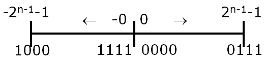
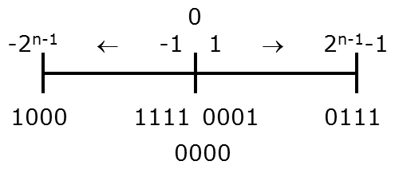

# C++ Notes (from CS 2150)
## 1/15/20
Why C++?
- More efficient, more control, fast
-	Data and program rep in memory
-	Memory allocation

Hello World:
```cpp
 #include <iostream>
using namespace std;
int main() {
	cout << “Hello World” << endl;
	return 0;
}
```
Differences from java:
-	Always return 0 for compiler
-	“#” calls the precompiler to bring in resources before execution
-	In < > if with compiler
-	In “” if our own file (.h extension)
-	“Using” keyword is similar to an import, namespace is sort of like a package
-	Can not import with using OR have to call each variable or resource with “std::”
-	Use “cin >>” and “cout >>” to take information in and out, respectively

Primitive Types
-	Int
-	Can be 16, 32, or 64 bits depending on where it is compiled
-	Float
-	7 decimals accuracy
-	Double
-	15 decimals accuracy
-	Char
-	Bool

Operators and expressions
-	A condition can be either an int or bool
-	Loops are all identical- for, while, do while, break, continue

We compile with clang++ (single-pass compiler)

Functions: Methods are NOT a member of the class
```cpp
Return_type name (input_type input_name){
	Return return_type
}
```
C++ isn’t bright and will forget functions after they are used.  This can be fixed by having function prototypes with the first line of the function but no contents, telling the compiler the code for that function is coming:
```cpp
Return_type name (input_type input_name);
```
## 1/17/20
Classes in C++
- We need to split up normal class programming into files
- Main method should go in its own class (.cpp is the extension), no specific name required; files must be included

Using an object is done like:
```cpp
IntCell m2(37);
```
Note the lack of an “equals”, not using pointers or references yet, just the object.  To call a default constructor you don’t use parenthesis.

Setting an object equal to another changes the contents of the object to the same as the other.  They stay distinct but the contents copy.

“.h” file: structure for a class.  Format as follows:
```cpp
#ifndef NAME_H
#define NAME_H
class Name {
	public:
		Name( type initialValue = initVal);
		returnType name (parameters) const;
    //const means the method will not modify the contents of the object (in this context) */
	private:
		type varName;
};
#endif
```
The actual body of the method is defined in the “.cpp” file format.  Make sure to include the .h file.  You also need double colon notation to prove you are referencing the methods for the object.  Example method:
```cpp
ObjectName::methodName(parameters) { //const, if necessary
	//Method contents
	Return return;
}
```
Note in constructors, you DO NOT need to list the default values as defined in the header.  The const transfers over and is on both.  Constructors look like:
```cpp
ObjectName::ObjectName(parameters) :
	fieldName( valueName ), fieldName2( valueName2), … {
}
```
Const can also be used to set a value at compiletime that cannot be changed, declared in constructor.  C++ compilation steps:
1.	Preprocessor- spits out preprocessed files
2.	Compiler- returns object files
3.	Linker- executable files
4.	Runs on Machine code
***Use “<<” to concatenate items to print, not “+”

Objects can be destroyed just as they are created.  In your header, define a destructor with a “~” before a copy of the constructor.

1/22/20
Preprocessing- going through a file and dealing with the “#” things
Examples
- #include <name> or “name”: direct copy of file specified to location specified
-	Includes can recursively call each other, breaking the preprocessor
-	Always place include statements in #ifs to prevent breaking
-	```#ifndef NAME```: if not defined; runs code within it if true; also works as #ifdef
-	```#endif```: end if any if
-	```#define NAME```: Defines a macro/direct text replacement; sort of a shortcut; like defining a constant; normally in all caps
-	Also works with objects, leaves them defined but not initiated

Pointers- stores a memory address of another object, either primitive or class, ALWAYS 8 bytes in size.  To declare, use a star:
```cpp
int * x;
Rational * rPointer;
```
This is used in expression DIFFERENTLY than in declaration:
```cpp
Int * x;
*x = 2;
```
This changes the value of the object being pointed to, not the physical pointer.

Ampersands (&) are used for reference types, used to get the address of something:
```cpp
X = &y
```
(\*) and (&) work inversely

You can use a double asterisk (\*\*) to have a pointer point to a pointer

Common pointer error: Not giving the pointer something to point to/not initializing the variable

## 1/24/20
Some items work using static memory- the computer knows how much memory will be used so it can allocate and deallocate for you.  If we don’t know the amount of memory needed, we need dynamically allocated memory to have more space on the fly.  To do this, we use the ```new``` keyword.  Ex. Declaring an array:
```cpp
Int * ages = new int[n];
```
Note that since it was defined with the “new” keyword, you need to delete it with the “delete” keyword.
```cpp
Delete pointer;
Delete [] ages;
```
One pitfall is to call a pointer to access a memory address whose object you have deleted.  Doesn’t cause an error so be aware.

Note that you can define primitive types just like you do objects to shorthand.  This is more efficient than making an integer in a pointer (1 line vs 4 lines):
```cpp
Int * x = new int(0);
```
Note that if a primitive type is created with the “new” keyword, you still must delete it.

You cannot delete memory that has already been deleted, causes “double free” error.

Accessing parts of the object: Each of the following are valid:
```cpp
Rational r;
r.num = 4;
//OR, with a pointer
Rational *r = new Rational();
(*r).num = 4;
//OR, as shorthand for above
r->num = 4;
```
Sometimes other classes need to access private data members from another class.  This is done with the ```friend``` keyword:
```cpp
class ListNode {
  private:
    friend class List;
 };
 ```
 Note that ```*``` is associative.  ```char* x, y``` makes x a char pointer but makes y a char.  To avoid this, move the star to the right: ```char *x, y```
 
 ## 1/27/20
 When requesting memory, double the space needed is allocated.  A key is put in front of the memory to note how large it is, making the ```delete``` function work.
 
 *References*: Similar to pointers with a few differences:
 1. Address cannot change
 1. Address must be set when declaring (result of above)
 1. Has implicit dereferencing
 
 Example of swapping reference values:
 ```cpp
 void swap(int & x, int & y) {
    int temp = x;
    x = y;
    y = temp;
}
```
Note the use of the ampersand.

After a reference is delcared, you can use them as a normal operator, without pointer notation with arrows:
```cpp
Square & squareRef = square;
int length = squareRef.sideLength;
```
*Call by Value*: Values are copied into a new variable to be manipulated by a function.  Can be safer but is inefficient.

*Call by Reference*: References are passed as parameters.  Should be used to change actual values for an object, not copies of it.

*Call by Constant Reference*: Same as Call by Reference except with the ```const``` keyword before parameters.  Means the parameters won't be modified.

Returning types can be done like calling (value, reference, etc.)

C++ provides 4 default methods when declaring anything:
- Default constructor
	- Does nothing
- Copy constructor
	- Copies all bytes of old one into new one
	- Doesn't care about contents
- Destructor
	- Called with ```delete``` function or when code goes out of scope.
- operator=()
	- Tells cpp how to use '=' operator between two objects
	- Declaration will be in different statement than the equals
	- Just copies bytes, no knowlege of contents

## 1/29/20

You can override how any operator works between two objects.  For example, you can change how '<<' works for cout.

C++s default library is rather weak compared to Javas.  Thus, we have limited options for objects in C++.

*Vectors*: Similar to array in C++.  Has a few problems: can't be copied with '=', no notion of capacity, no index validity checking.  Some methods:

- int size(): how big it is
- int capacity(): how much space there is, not how much is in the vector
- void reserve(int newCapacity): specify size of the vector
- void push_back(Object e), pop_back(): used for stack-like operations
- Object& back(), front(): return end and beginning of vector
- Object& at(int x): get object at index
- Object& operator[](int x): overrides bracket syntax, not smart like 'at' is

*Iterators*: Nested type that represents position in a vector.  Iterators use overrides for shorthand to save time:

- ++: moves forward; --: moves backward
- \*: removes pointer to object at iterator
- ==, !=: true if same location, false otherwise
- use begin() and end() to point to the beginning or end of vector.

Use of an iterator looks as follows:
```cpp
for(vector<int>::iterator it = v.begin(); it != v.end(); it++){
	cout << *it << endl;
}
```

Vectors can do special functions with iterators: insert, erase are examples.

## 1/31/20

While Java uses inheritance to write code, C++ uses templates for functions and classes.

Function templates look as follows:
```cpp
template <typename Comparable>
const Comparable& findMax (input){
	//function
}
```
Note that no type is specified.  This tells C++ that this is a template.  We can then use this template for multiple types instead of creating unique methods for each.  It will check for operators in the function to properly override them.

You can also make these templates for classes to expand to different types of objects:
```cpp
template <typename Object>
class NewObject {
	public:
		NewObject(const Object& initValue = Object()) : storedValue(initValue) {}
		//Some Methods
	Private:
		//Some values
}
```
Note that templates can have more than one parameter, nontype parameters, and have default values for those parameters.

*Stacks*: Last In, First Out.  Like a stack of papers, add values on top, take next value from top.  Opposite is a queue.  Java provides default methods in their class such as push (insert at top), pop (delete from top), and top (get top value).  Example uses include postfix calculators, activiation records,  and symbol balancing.

Stacks can be implemented with a linked list, array, or vector.

## 2/3/20

## 2/5/20
*Radix to decimal*: Conversion of bases from another type to decimal.

*Decimal to radix*: Conversion from a base 10 number to a radix number.  Divide by radix number, take whole values left (NOT REMAINDER) and redivine, storing the remainders in order until no more redivisions are required (i.e. spits out 0r_something_).  Answer is remainders in REVERSE order.

C++ supports specifying base by leaders on a integer.  A leading '0' on a number specifies an octal (base 8) while a leading '0x' specifies a hexidecimal (base 16).  These two work well but others don't have much use.

Binary doesn't have an easy way to specify it is a binary number.  There is, however, an easy way to go between octal and hexidecimal.  Each 4 binary digits correspond to a single hex digit.  (ex. 1101<sub>2</sub> = d<sub>16</sub>)

The first computer build was the ENIAC.  Uses vacuum tubes and computed ballistic tables and an insane amout of power.  The vacuum tubes ran slow and binary representation became more popular with future technologies that allowed storing information in cells to be easier.  This allowed binary to enter the mainstream.

C defines the size of an integer or variable by implemetation definition.  It can be anywhere between small and massive.  Most machines run 32 bit integers but some run 64 bit integers depending on the machine and operating system.  ```sizeOf(int)``` tells you how large your int is.

*The Endian Debate*: Computers can change which bit is the most signifigant.  **Big-Endian** works how we think with the largest bit on the far left.  Computers, however, think in **Little-Endian** which puts the largest bit the furthest to the right.  This is primarily due to addressing; the highest address should have the highest value, which is the right most digit.  Note that this effects ONLY the BYTES, NOT the BITS.  Example: in big-endian, 0xdeadbeef; in little-endian, 0xefbeadde.  The primary issue comes with network communication.  All network communication is generally done in big-endian while computers run in little-endian.

*Integer Representation*: We generally reserve the left-most bit for the sign of the integer and use the rest to define numbers.  One must be careful; at first glance, two 0s exist.  100...0 is a -0 while 000...0 is a 0.  We deal with this a few ways:

- One's Compliment:
	- 
	- No longer used
- Two's Compliment:
	- 
	- Most commonly used
	- One more negative value as compared to positive values

When integers overflow, it will effect the sign bit at the beginning and change the sign/magnitude of the bit.  Note that, by how Two's Compliment works, this overflows from the max to the min value (which has a magnitude one greater than max!).

Note that C++ also has the ability to have unsigned ints.  Thus, we just remove the signed bit and have a lot more potential values.  This is commonly found for returning the size of an object as they cannot go negative.
