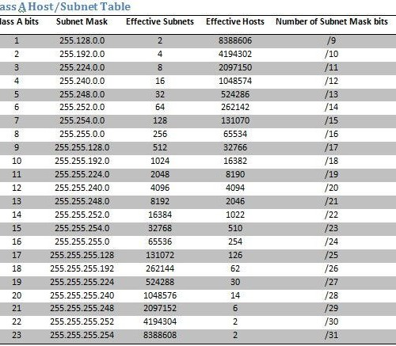

# Networking Basics
## Terms
*IP Address*: : Specifies internet address to access computer.  Follows XXX.XXX.XXX.XXX format where 0 <= XXX <= 255.  Public addresses are used for the world to see.  Inside a network there are three ranges: 192.168.XXX.XXX, 172.16.XXX.XXX-172.32.XXX.XXX, and 10.XXX.XXX.XXX./n

*Subnet Masks*: Specifies network size and ip ranges.  Normal range is 255.255.255.0 or /24.  Allows access to all devices in range (minus the two ends) to communicate.  Chart of subnets with their shortcuts below:

*Gateway*: Location to send traffic when trying to get out of a specific network.  Normally the first address in the range (ex. 192.168.1.1)

*Wide Area Network (WAN)*: The wan is the given name for the outside of your personal network.  Your gateway/router/access point to the network runs a single (or a few) IPs on its wan network to act as the entire subnetwork below it.

*Local Area Network (LAN)*: The lan is the network “below” your gateway/router.  This network is a localized, normally secured network that all machines communicate with the gateway to perform other actions and access the internet.

*Virtual Local Area Network (VLAN)*: A vlan is a virtualized subnetwork of a lan.  vlans can be identified by their tagged packets by the number the vlan holds.  This allows for segmentation of an internal network beyond IP addresses; setting a machine to only access a specific vlan can allow different VMs or submachines to access those tagged packets.
*Never use vlan 0 or vlan 1.  Some machines handle packets with these tags differently and packets may not act as anticipated.

*Bridge Ports*: Bridge ports are ports on a physical machine that has two primary functions.  Bridge ports can be used to bridge VM networks to a physical interface, allowing them to see the physical ethernet port on the machine.  Bridge ports can also be used to merge two or more separate physical NICs as a single virtual device.  This can increase transfer rate by sending packets for a single process through multiple physical wires.
