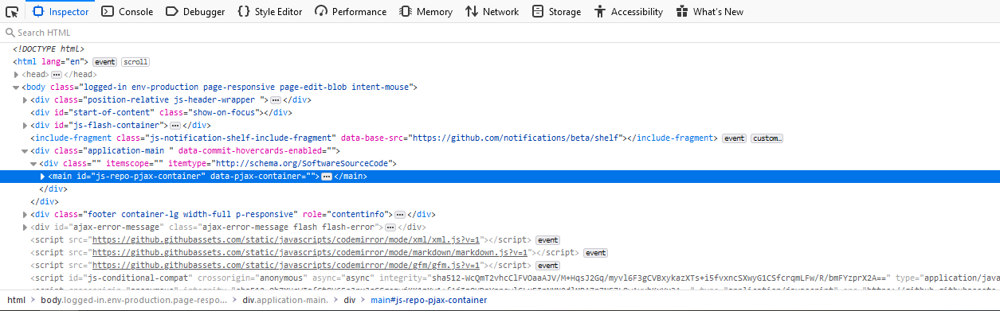

# Web Basics (HTML, CSS, JS)
## Terms
Hypertext Markup Language (HTML): Turing complete language used to create websites and webpages.  Commonly used for formatting and holding information found in a site, not formatting or functionality.
Cascading Style Sheets (CSS): Language used to specify the styling of an html document.  Must be included in the header and works most often with classes and ids.  In charge of style, not content or functionality.
Javascript (JS): Language used to add interactivity and functionality to a website.  Runs client side, i.e. not secure.  Used to change content or styling of a sheet mid execution or can be used to call server side scripting.

## HTML Basics
HTML Documents are used for the foundation of a website.  They do things through tags, which look like ```<>```.  A generic HTML document looks like:
```html
<!DOCTYPE html>
<html>
  <head>
    <link rel="stylesheet" href="style.css" />
    <title>My page</title>
  </head>
  <body>
    Hello world!
  </body>
</html>
```
Note that each tag that is opened MUST be closed.  This is either achieved by a closing tag (body tag above) or by a self-closing tag, which is one without text in it (such as the link tag above).  Text in tags is never shown.

HTML has two main parts: the head and the body.
- The head is the part used to specify important components of the site that aren't shown on the actual webpage.  Title and Link are both common tags put here.  More on what they do below.
- The body is what is actually displayed on your webpage.  This is where the majority if your site should go.

You can always see what the current page you are working on looks like by hitting 'Inspect Element' on your browser or downloading the page.  An inspect element page commonly looks like:

You can clearly see the start of the html tag, head tag (which is minimized), and the start of the body.

Tags in HTML often take attributes.  Attributes are used to give more information about the tag such as an image source, specific styling to use, or an action to do when clicked.  Attributes are specified as follows:
```html
<div class="test">
  This div has an attribute 'class' with the value 'test'.
</div>
```
The most common attributes are classes and ids but other tags have their own specific attributes to add additional functionality, such as a link redirection location or alternate text for an image.  Classes and IDs will be explained more in the CSS section, but know they are separeted by spaces in HTML.

## HTML Tags
HTML has tons of included tags that do a myriad of different things.  Here are some more useful ones:
- ```<title></title>```: used to specify the title of the page, more commonly known as the name of the tab.  That is found in your web browser to preview what the tab is about and is generally on the top of your screen.  Short, informative titles are often best.  Always placed in the header.
- ```<link/>```: used to link another file (normally CSS or JS) into your document and add its attributes.  Always placed in the header.
- ```<div></div>```: used to specify a block on your site.  Information is commonly put in a div in order to apply CSS to it through classes or ids.  Divs apply no additional formatting.
- ```<p></p>```: short for paragraph, this tag is used for a paragraph of text.  It generally applies rudimentary formatting such as adding a margin below said paragraph to more clearly define it and text wrapping if not default.  Commonly put inside a div.
- ```<span></span>```: used to apply custom formatting to a specific range of text, usually in a paragraph.  Often used to change a specific word or phrase when a certain action is performed.
- ``````: defines an image to be placed in the document.  Formatting by default is the full pixel size of the image so CSS is usually necessary to fix this.  The image source is specified with the ```src``` modifier and, if the image cannot load, it shows text specified in the ```alt``` modifier.  Self-closing tag.
- ```<br/>```: makes a line break in the page.  Same as hitting enter.  Self-closing tag.
- ```<a></a>```: makes a link.  Specify link destination with ```hfef``` modifier.
-```<ol></ol> and <ul></ul>```: defines a ordered and unordered list, respectively.  Ordered lists are numbered while unordered lists use bullet points.
-```<li></li>```: defines a list item.  Work when put inside an ordered or unordered list and specify a single number/bullet point each.
-```<form></form>```: creates a new form.  Form has its own special tags that go inside to create forms to submit information, such as ```<input>``` for fields, ```<label>``` for normal text, and ```<button>``` for submitting.  More info on forms can be found [here](https://www.w3schools.com/html/html_forms.asp).
-```<col></col> and <row></row>```: used to make tables in HTML.  More commonly used with bootstrap.

## CSS basics

## Useful CSS modifiers

## Javascript Basics
